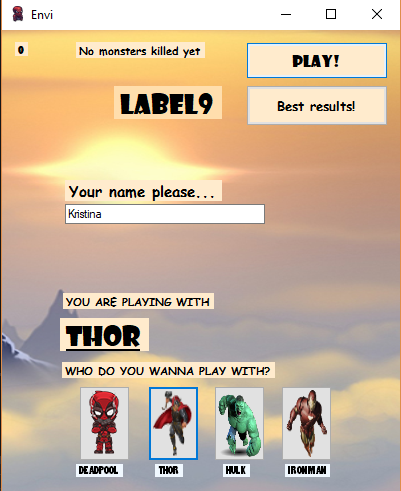
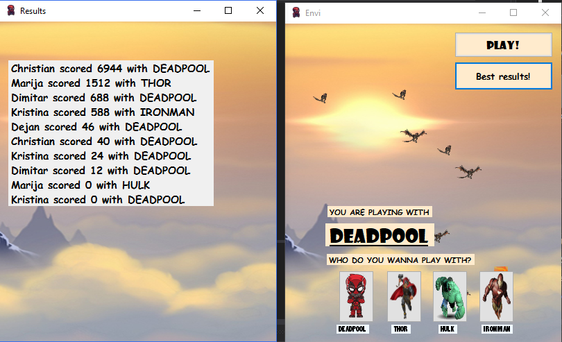

# Envi

<h3>Опис:</h3>

Станува збор за игра во којашто играчот има за цел главниот херој (човечето кое што го контролира играчот со глувчето) да остане жив што е можно подолго. Херојот е позициониран најдолу на y-оската и се движи лево-десно. Од горниот дел на формата се појавуваат чудовишта. Бројот на чудовишта кои што се појавуваат во даден момент е случајно избран број чиј максимум варира во зависност од големината на формата. Брзината со која што се движат е исто така случајно избран број. Играчот се обидува да ги избегне чудовиштата, но покрај тоа тежнее кон нивно убивање, со што би добил повеќе поени и би се пласирал повисоко на ранглистата составена од најдобри 10 играчи.

  

 <i color="gray">Слика 1: Почетен прозорец на играта</i>

Можноста за почеток на игра не е дозволена (односно копчето не може да се кликне) се додека не се внеси име на играч.

  

 <i color="gray">Слика 2: Почетен прозорец на играта откако ќе се внесе име</i>

Како што може да се забележи на Слика 1, даден е избор од четири херои и тоа (Deadpool, Thor, Hulk и Ironman), откои што Deadpool е default во случај играчот да не избере играч. Со притискање на копчето Play се започнува играта. Во прв левел се појавуваат само најлесните за убивање чудовишта наречени MonsterWeek кои што наследуваат од абстрактната класа Monster. Чудовиште од овој тип е потребно да се погоди точно еднаш за да се смета за убиено. Во второто и третото ниво чудовиштата се наречени MonsterMedium и MonsterStrong и за да се сметаат за убиени (односно да се избришат од листата MonstersList) потребно е да се погодат два и три пати соодветно. MonsterStrong е всушност голема огнена топка која што не се движи само вертикално туку и дијагонално. Имено, доколку се појави на левата страна ќе почне да се движи долу-десно, а доколку пак се појави на десната страна ќе почне да се движи долу-лево.
Куршумите наречени BulletType1 и BulletType2 кои наследуваат од IBullet, менуваат јачина во зависност од нивото. 

  
  
  

Нивото се зголемува во зависност од променливата score. Односно доколку score е помало или еднакво од 600 играта се одвива во прво ниво, доколку score е помеѓу 600 и 1200 e второ, итн.
Напомена: Тежината на нивото на прикажаните слики се разликува од онаа во кодот.

        public void checkForLevel()
        {
            if(score > 1200)
            {
                level = 3;
                monsters = new Monsters(3);
                label10.Text = "Level 3!";
                Form1.ActiveForm.BackgroundImage = Envi.Properties.Resources._3;
                label10.Font = new Font("Comic Sans MS", 20, FontStyle.Bold);
            }
            else if (score > 600 && score <=1200)
            {
                level = 2;
                monsters = new Monsters(2);
                label10.Text = "Level 2!";
                Form1.ActiveForm.BackgroundImage = Envi.Properties.Resources.sky;
                label10.Font = new Font("Comic Sans MS", 20, FontStyle.Bold);
            }
            else if(score <= 600)
            {
                level = 1;
                monsters = new Monsters(2);
                label10.Text = "Level 1";
                Form1.ActiveForm.BackgroundImage = Envi.Properties.Resources.back;
                label10.Font = new Font("Comic Sans MS", 14, FontStyle.Bold);
            }
        }

Воведена е можност за пауза

  

 <i color="gray">Слика 6: Пауза</i>

Формата е resizable односно корисникот може да ја менува нејзината големина по желба и сите функционалности си остануваат.

  

 <i color="gray">Слика 7: Промена на големина на форма</i>

Во посебен фолдер се чува .txt документ кој ги содржи најдобрите десет резултати. Секогаш кога ќе се отвори апликацијата се вчитуваа содржината на тој фолдер и секоја линија се преведува во објект од Result класата па секој Result се додава во листата ResultsList која што е сортирана по големна на score аргументот.
<b>Напомена: ResultsList содржи најмногу 10 елементи, работи на принцип на исфрлање на најслабите </b>

  

 <i color="gray">Слика 8: Преглед на формата за најдобри резултати</i>

<h3>Структура на кодот:</h3>
Кодот се содржи од две форми:
<ul>
  <li>главната форма</li>
  <li>формата што ги прикажува најдобрите резултати</li>
</ul>

Покрај тоа има три фолдери и една класа за Карактерот
<ul>
  <li>Фолдер што ги содржи сите потребни класи за Monster</li>
  <li>Фолдер што ги содржи сите потребни класи за Bullet</li>
  <li>Фолдер што ги содржи сите потребни класи за Results</li>
  <li>класа Character</li>
</ul>

  

 <i color="gray">Слика 10: Структура на кодот</i>

